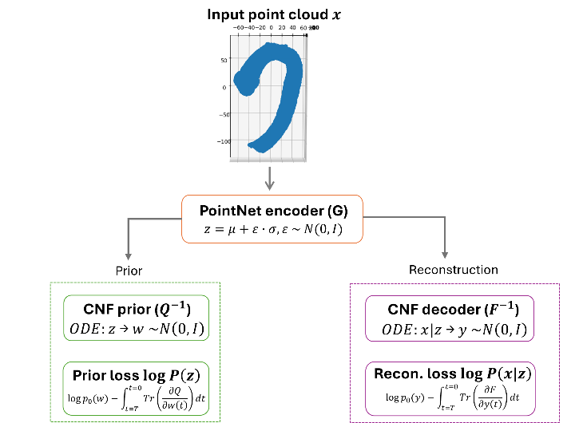
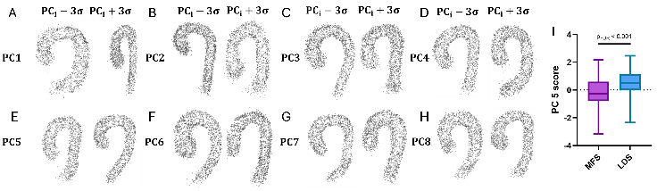
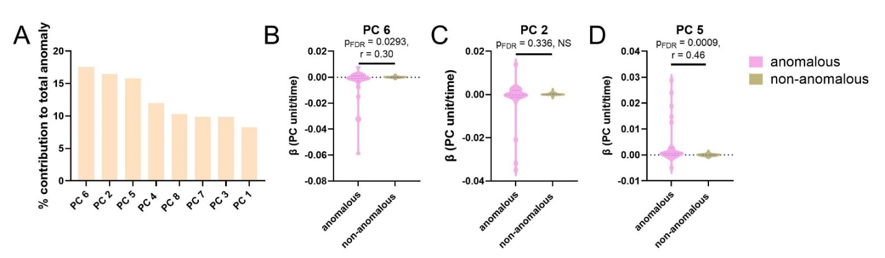

# Beyond Diameter

**Learning the full 3D shape of the thoracic aorta to track aneurysm growth in Marfan and Loeys-Dietz syndromes.**

- Accepted for **oral presentation at BMES 2026**
- Journal manuscript **under review**
- Project page: https://violayfw.github.io/beyond-diameter/

---

## The idea

Aortic aneurysms in Marfan (MFS) and Loeys-Dietz (LDS) syndromes are monitored mainly by one number: the maximum aortic diameter.

But the disease also changes aortic length, arch curvature, and how the descending aorta bends. One number can't capture that.

Beyond Diameter learns the **whole shape** instead, and asks what it reveals that diameter misses.

## How it works

Each aorta is a 3D point cloud from CT (518 scans from MFS and LDS patients). The model has three parts:

1. A **PointNet encoder** compresses each aorta into a 16-number code.
2. A **continuous normalizing flow (CNF) prior** organizes those codes into a well-structured space.
3. A **conditional CNF decoder** rebuilds the full aorta from a code (normalized Chamfer distance < 0.001).

## Key findings

- **Eight readable shape modes** explain 97% of shape variation: width, ascending length, arch curvature, ascending dilation, descending elongation.
- **PC5 separates MFS from LDS** (p_FDR < 0.001). LDS aortas are more curved.
- **Unusual growth over time** is driven by coordinated, multi-segment changes:
  - PC5, increasing ascending curvature and descending bending (p_FDR = 0.0009, r = 0.46)
  - PC6, ascending dilation with upper descending elongation (p_FDR = 0.029, r = 0.30)

## Code

Code will be released with the publication.

## Authors

**Yufan (Viola) Wu**, Yusuf A. Ozturk, Krashn Dwivedi, Alan Braverman, Fanwei Kong, Jessica Wagenseil

Washington University in St. Louis

Contact: [LinkedIn](https://www.linkedin.com/in/viola-w-0440a3196/)
